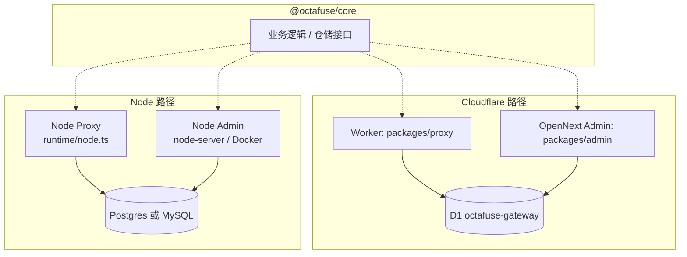
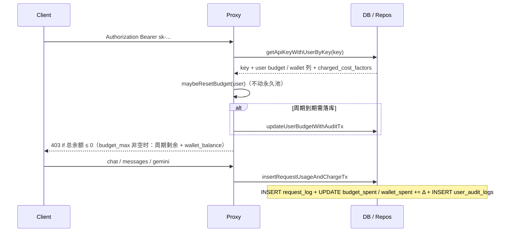

# 运行时与数据存储架构（Octafuse）

`@octafuse/core` 承载统一的类型、仓储与领域逻辑；**对外交付形态**由两套正交选择决定：

1. **运行时**：**Cloudflare 边缘**（Worker / Pages + OpenNext）或 **Node.js**（本机/Docker/K8s 等）。
2. **数据存储**：**D1**（SQLite、Cloudflare 绑定）、**PostgreSQL** 或 **MySQL 8**（均通过 Node 侧 **`DATABASE_URL`** + **`DATABASE_DRIVER`** 选择；Worker 仅 D1）。

二者组合后得到下文的「部署模式」。同一业务语义下，D1、Postgres 与 MySQL 使用**各自迁移目录**保持 schema 对齐（见文末）。

---

## 能力矩阵（按组件）

| 组件 | Cloudflare 运行时 | Node 运行时 | 数据库 |
|------|-------------------|-------------|--------|
| **代理服务（Proxy）**（`packages/proxy`） | Worker：`npm run dev:proxy` / `deploy:proxy`；**仅绑定 D1**，不用 `DATABASE_URL` | `npm run dev:proxy:node`（`packages/proxy/src/runtime/node.ts`）；**Postgres 或 MySQL**（`DATABASE_DRIVER` + `DATABASE_URL`） | **D1 ⊕ Postgres ⊕ MySQL**（同进程不能混用） |
| **管理后台（Admin）**（`packages/admin`） | OpenNext + wrangler：`npm run dev:admin` / `deploy:admin`；**绑定同一 D1** | 本地开发：`npm run dev:admin:node`（或 `packages/admin` 内 `npm run dev:node`，`:8789`，含调试台实时 WS）；生产：`tsx runtime/node-server.ts` / Docker `node packages/admin/node-server.mjs`：需 **`DATABASE_URL`** + **`DATABASE_DRIVER`**（与 Node 代理服务同语义；Postgres 可省略驱动，**MySQL 须 `mysql`**）与 **`ADMIN_*`** | **D1 ⊕ Postgres ⊕ MySQL 二选一** |
| **Core**（`packages/core`） | 被 Worker / Pages 以 `d1` 驱动引用 | 被 Node 以 `postgres` / `mysql` 驱动引用 | 迁移见下 |

> **约束**：Cloudflare Worker **不能**直连外部 Postgres/MySQL；若在边缘保留 Worker，则数据库只能是 **D1**。要用 Postgres 或 MySQL，代理服务 / 管理后台须在 **Node** 跑（例如 Docker 自托管，见 [docker.md](../../operators/deployment/docker.md)）。

---

## 部署模式（三种常见拓扑）

| 模式 | 代理服务 | 管理后台 | 数据库 | 典型场景 |
|------|---------|--------|--------|----------|
| **A. Cloudflare 全托管（默认）** | Worker | Pages（OpenNext） | **共用 D1** | 生产默认；运维最简单 |
| **B. Hybrid** | **Node**（容器/VPS） | 仍为 **Cloudflare Pages** | 代理服务=**Postgres**，管理后台=**D1**（两库需分别迁移/对齐，适合分阶段上 PG） | 推理侧先行迁 PG，管理端仍在 CF |
| **C. Full Node + Postgres** | Node | Node（Next 容器等） | **同一 Postgres** | 全自托管、与 K8s/Docker 一致；见 Docker 文档 |
| **C′. Full Node + MySQL 8** | Node | Node（Next 容器等） | **同一 MySQL** | 与 C 相同交付形态；迁移目录 `migrations-mysql/` |

详细步骤与变量（本表为 SSOT；其它文档只摘要并链回此处）：

- 模式 A：[cloudflare.md](../../operators/deployment/cloudflare.md) · 首次上云 [cloudflare-quickstart.md](../../operators/deployment/cloudflare-quickstart.md)
- 模式 B / C、Docker、双镜像：[docker.md](../../operators/deployment/docker.md)
- D1 ↔ Postgres 迁移/对账脚本：[d1-postgres-cutover.md](../../operators/migrations/d1-postgres-cutover.md)
- 部署索引入口：[deployment/README.md](../../operators/deployment/README.md)

---

## 关系示意（逻辑视图）

> 图中 **cf** 与 **node** 为并列交付方式；生产一般只选其中一条「竖条」（全 D1 或全关系型 PG/MySQL），Hybrid 则代理服务与管理后台分别落在不同竖条（含两套存储）时需严格约定账号与迁移顺序。

---

## 迁移脚本位置

| 目标库 | SQL 目录 | 常用命令（仓库根） |
|--------|-----------|-------------------|
| **D1** | `packages/core/migrations-d1/` | `npm run db:migrate` / `db:migrate:remote`（`packages/core/wrangler.d1.jsonc`） |
| **PostgreSQL** | `packages/core/migrations-postgres/` | `npm run db:migrate:pg`（`packages/core/src/migrate/cli.ts` → `migrate/postgres.ts`） |
| **MySQL 8** | `packages/core/migrations-mysql/` | `npm run db:migrate:mysql`（同上 CLI → `migrate/mysql.ts`）；容器内 `db:migrate:mysql:docker` |

环境变量约定见仓库根 **[`.env.example`](../../../.env.example)**；本地组合 D1 / PG / MySQL、Hybrid 调法见 **[local-development.md](../local-development.md)**。

### 供应商 `endpoints`

- 迁移 **`0011_provider_endpoints`**（d1 / postgres / mysql）：`providers` 新增 **`endpoints` TEXT**，并从当时的 `base_url_*` 回填 `{ protocol: { base } }`。
- 迁移 **`0012_drop_provider_base_url_columns`**：删除 `base_url_openai` / `base_url_anthropic` / `base_url_gemini`；读写仅以 **`endpoints`** 为准（`parseProviderEndpoints` / 管理后台写入）。
- 形状：`{ "openai"?: { "base"?: string, "endpoints"?: { "chat"|"images.generations"|"images.edits"|"audio.transcriptions": url } }, "anthropic"?: …, "gemini"?: { "base"?: string, "auth"?: "query-key"|"bearer", "endpoints"?: … } }`。`base` 走标准路径派生；capability 完整 URL 模板存在则不再追加后缀。`gemini.auth` 省略时为 `query-key`。
- 迁移 **`0015_single_provider_key`**：`providers` 恢复单列 **`api_key`** + **`status`**；删除 **`provider_api_keys`**；`model_routes.weight`；`models.route_policy` 替换 `sticky_config`；种子 **`ROUTE_STRATEGY`**。切换步骤见 [single-provider-key-cutover.md](../../operators/migrations/single-provider-key-cutover.md)。
- 迁移 **`0016_route_surfaces_pools`**：新增 `model_surfaces` / `route_pools`；`model_routes` 增加 `route_pool_id`、`upstream_operation`、`adapter`；请求日志增加请求入口 / 路由池 / 上游目标与路由追踪字段。完整模型见 [route-topology.md](./route-topology.md)。
- 迁移 **`0017_gemini_models_generate`**：将 Gemini `generateContent` / `streamGenerateContent` 请求入口合并为家族 operation **`models.generate`**；规范化 `model_routes.upstream_operation`；冲突路由池降级为 `inactive` 并加 `[v220-conflict]` 名字前缀。切换步骤见 [gemini-models-generate-cutover.md](../../operators/migrations/gemini-models-generate-cutover.md)。
- 迁移 **`0018_route_pool_tier_strategies`**：`route_pools` 新增 **`tier_strategies` TEXT**（JSON map：`{"10":"hash_affinity","0":"weight_priority"}`），支持按优先级层覆盖同层路由策略。切换步骤见 [route-pool-tier-strategies-cutover.md](../../operators/migrations/route-pool-tier-strategies-cutover.md)。
- 迁移 **`0019_route_strategy_canonical_ids`**（2.2.0 历史阶段）：将 `affinity` / `strict` / `round_robin` 硬切换为当时的 canonical ID `cache_affinity` / `fixed_order` / `weighted_round_robin`（`weighted_random` 不变）。覆盖 `system_config.ROUTE_STRATEGY`、`route_pools.strategy`、`route_pools.tier_strategies`、`models.route_policy`。历史步骤见 [route-strategy-canonical-ids-cutover.md](../../operators/migrations/route-strategy-canonical-ids-cutover.md)。
- 迁移 **`0020_route_pool_sticky_routing`**：`route_pools` 增加 `sticky_enabled` / `sticky_idle_ttl_seconds` / `sticky_epoch`；新表 **`route_pool_sticky_bindings`**（跨 isolate 共享供应商粘性）。见 [route-pool-sticky-routing-cutover.md](../../operators/migrations/route-pool-sticky-routing-cutover.md)。
- 迁移 **`0021_route_strategy_display_ids`**：将 `cache_affinity` / `fixed_order` 再次硬切换为现行 `hash_affinity` / `weight_priority`，覆盖上述四个持久化位置且无旧 ID 别名。维护窗口步骤与校验 SQL 见 [route-strategy-display-ids-cutover.md](../../operators/migrations/route-strategy-display-ids-cutover.md)。
- 迁移 **`0022_request_log_audio_characters`**：请求日志增加 `audio_characters`，独立记录 TTS 上游返回的有效计费字符数。
- 迁移 **`0023_admin_access_identity`**：新增 `admin_api_keys` / `admin_sessions`，并把历史 `system_config.MASTER_KEY` 复制为全权限 `legacy-master`。
- 迁移 **`0024_drop_legacy_master_key_config`**：删除历史 `system_config.MASTER_KEY` 配置行；新版管理认证只读取具名 Admin API Key 与控制台会话。
- 迁移 **`0025_user_audit_actor_index`**：为 `user_audit_logs(actor_id, created_at)` 增加操作主体查询索引。
- 迁移 **`0026_user_charged_cost_factors`**：`users` 增加 `charged_cost_factors`，按目录模型 ID 保存用户计费倍率。
- 迁移 **`0027_user_wallet_credit`**：`users` 增加 `wallet_granted` / `wallet_spent`（永久额度）；`user_audit_logs.dedup_key` + `UNIQUE(user_id, dedup_key)`；`api_key_request_logs.charged_wallet_cost`。老数据把加购余额从 `budget_max` 拆出；`budget_max IS NULL` 与到期清零行（`max=0 AND period=none`）不抬回 `budget_base`。步骤见 [0027-user-wallet-credit.md](../../operators/migrations/0027-user-wallet-credit.md)。
- 迁移 **`0028_key_rate_limit_and_ingress`**：`api_keys.rate_limit` 与 `users.rate_limit`（JSON，`NULL` = 该层不限；当前仅 `rpm`）；用户层为所有 Key 合计，Key 层为单把钥匙。`api_key_request_logs.ingress_host` 只记录入口 Host，不做准入。成功记账时回写 `api_keys.last_used_at`。RPM 窗口计数在代理服务进程 / isolate 内存中，不落库。

#### Endpoint capability 维护规则

与 `resolveUpstreamEndpoint` / `listConfiguredCapabilities` 语义一致：

| 配置方式 | 可用 capability | 管理后台卡片展示 |
|---------|-----------------|----------------|
| 只填 `base` | 该协议全部 capability | 全部标签（OpenAI：`chat` + `images` + `audio`） |
| 只填部分 capability URL、**不填 base** | **仅**已填写的那些 | 仅对应标签（如只配 chat → `chat`） |
| 填了 `base` + 部分 overrides | **仍是全部**；空的 override ≠ 禁用，只是「用 base 派生」 | 全部标签 |

运营约定：

- **全能力上游**：填 Base URL；需要非标准路径时再填个别 URL overrides。
- **部分能力上游**（例如仅 chat 的中转）：**清空 Base**，只填写支持的 URL overrides。
- **不要**用「填了 Base 但留空某些 override」表达「不支持该能力」——运行时仍会从 Base 派生并可能打到错误路径。

管理后台静态导入模板（`packages/admin/lib/provider-import-presets.json`）遵循同一约定：默认 LLM 供应商写入 `openai.endpoints.chat`；具备完整 OpenAI 兼容 Images（含 generations **与** edits）的模板写 `openai.base`（如 OpenAI、Azure OpenAI、SiliconFlow、Zhipu/Z.AI、xAI、Together、Gemini OpenAI 兼容层等）。**Volcengine Ark** 无 edits，故只写 `endpoints.chat` + `endpoints.images.generations`，**不**写 `base`（避免派生死链 `/images/edits`）。OpenRouter Images 路径为 `/api/v1/images`，在 `openai.base` 之外用 `endpoints.images.generations` 覆盖。

---

## 用户 / API Key / 用量数据流（Proxy）

鉴权与扣费路径在三种存储上一致，仅事务封装不同（D1 用 `batch()`；Postgres / MySQL 用 Drizzle 事务 + 条件 `UPDATE` 防并发 lazy reset 双写审计）。

- **表级关系与不变量**（email / external 约束、多 active key、级联规则）：[user-keys-data-model.md](./user-keys-data-model.md)。
- **审计事件与列语义**：[../reference/user-audit-logs.md](../reference/user-audit-logs.md)。

---

## 路由调度运行时状态（策略 / 熔断）

> **完整请求处理路径**（鉴权 → 路由 → 策略 → 故障转移 → 记账）：见 **[proxy-request-lifecycle.md](./proxy-request-lifecycle.md)**。
> **请求入口 → 路由池 → 上游目标拓扑**：见 **[route-topology.md](./route-topology.md)**。
> **策略语义与六级解析**：见 **[route-strategies.md](../reference/route-strategies.md)**。
> **0015 / 0016 切换步骤**：见 **[single-provider-key-cutover.md](../../operators/migrations/single-provider-key-cutover.md)**。  
> **0017 Gemini `models.generate` 切换步骤**：见 **[gemini-models-generate-cutover.md](../../operators/migrations/gemini-models-generate-cutover.md)**。
> **0018 按优先级层策略切换步骤**：见 **[route-pool-tier-strategies-cutover.md](../../operators/migrations/route-pool-tier-strategies-cutover.md)**。
> **0019 历史 canonical 策略 ID 切换步骤**：见 **[route-strategy-canonical-ids-cutover.md](../../operators/migrations/route-strategy-canonical-ids-cutover.md)**。
> **0020 / 0021（2.3.0）切换步骤**：见 **[route-pool-sticky-routing-cutover.md](../../operators/migrations/route-pool-sticky-routing-cutover.md)** 与 **[route-strategy-display-ids-cutover.md](../../operators/migrations/route-strategy-display-ids-cutover.md)**。
> **0022–0025（2.4.0）升级说明**：见 **[2.4.0 发布说明](../../releases/2.4.0.md#升级说明)**。
> **0026（2.7.0）升级说明**：见 **[2.7.0 发布说明](../../releases/2.7.0.md#升级说明)**。

### Schema（迁移 **0015–0028**，三库同语义）

| 对象 | 含义 |
|------|------|
| **`providers.api_key`** / **`providers.status`** | 一个供应商（Provider）= 一把上游密钥；`status` 为 `active` \| `disabled`。**无** `provider_api_keys` 表 |
| **`model_surfaces`** | 公开请求入口（Request Surface）：`model_id + route_group + request_protocol + request_operation` → `route_pool_id` |
| **`route_pools`** | 一组可故障转移的上游目标（Upstream Target）容器；`strategy` 可覆盖模型与全局策略，`tier_strategies` 可按优先级层继续覆盖；`sticky_enabled` / `sticky_idle_ttl_seconds` / `sticky_epoch` 管理路由池（Route Pool）级供应商粘性（Provider sticky） |
| **`route_pool_sticky_bindings`** | 供应商粘性的共享绑定；按 affinity hash 记录上游目标、epoch、token、访问与过期时间，供 Worker isolate / Node 实例共同使用 |
| **`model_routes.priority`** | 硬序优先级层（**DESC**，数字越大越先试） |
| **`model_routes.weight`** | 同 priority 优先级层内权重（默认 `1`；策略用） |
| **`model_routes.route_pool_id` / `upstream_operation` / `adapter`** | 上游目标所属路由池、上游 capability 与转换方式；同协议使用 `passthrough`，OpenAI Images / ASR / TTS 转 DashScope 使用注册表中的显式 adapter |
| **`models.route_policy`** | 可选 TEXT JSON：`strategy` + `rules`；`NULL` = 回退全局 |
| **`system_config.ROUTE_STRATEGY`** | 全局缺省策略（默认 `hash_affinity`；进程内缓存 30s） |
| **`api_key_request_logs.audio_characters`** | TTS 上游返回的有效计费字符数；与 ASR 时长独立记录 |
| **`admin_api_keys` / `admin_sessions`** | 具名管理 API Key 与持久化控制台会话；不再从 `system_config.MASTER_KEY` 鉴权 |
| **`user_audit_logs(actor_id, created_at)`** | 按操作主体与时间检索用户审计的联合索引 |
| **`users.charged_cost_factors`** | 可选 JSON：目录模型 ID → 非负用户计费倍率；只改变最终用户费用与预算累加 |
| **`users.wallet_granted` / `wallet_spent`** | 永久额度累计发放 / 累计消耗；余额派生，不随周期重置或到期清零 |
| **`user_audit_logs.dedup_key`** | 加额幂等键（`UNIQUE(user_id, dedup_key)`）；`wallet_credit` 用 `external_ref` |
| **`api_key_request_logs.charged_wallet_cost`** | 本次请求从永久池扣掉的部分；周期部分 = `charged_cost − charged_wallet_cost` |
| **`api_keys.rate_limit`** | 每 Key 限流 JSON；`NULL` 不限。当前 `rpm` 为从当前时刻回溯 60 秒的请求上限，`0` 拒绝计次请求 |
| **`users.rate_limit`** | 用户层限流 JSON（与 Key 同形状）；`NULL` 不限。当前 `rpm` 为该用户所有 Key 合计、同样回溯 60 秒的上限 |
| **`api_key_request_logs.ingress_host`** | 请求打到的入口 Host（只记录，不做准入） |

已移除：`provider_api_keys`、`limit_config`（网关 RPM/TPM/并发软限流）、`models.sticky_config`（旧粘性 key 绑定；由路由池级 **供应商粘性** + `route_pool_sticky_bindings` 替代）。

请求日志列 **`provider_key_id` / `provider_key_label` / `provider_key_fingerprint`** 仍保留列名，语义改为 **`providers.id` / `providers.name` / fingerprint(`api_key`)**。0016 另增加 `request_operation`、`model_surface_id`、`route_pool_id`、`route_target_id`、`upstream_operation`、`adapter`、`route_trace`。

### 运行时组件（`packages/proxy/src/services/`）

- **`route-strategies/*`** — 同层排序：`hash_affinity`（加权 Rendezvous）、`weighted_random`、`weight_priority`、`weighted_round_robin`。
- **`provider-sticky-routing.ts`** — 查询 / 校验共享粘性绑定；命中时把绑定上游目标跨 priority 前置，成功后 bind / touch，供应商可归因失败时解绑。
- **`route-attempt-planner.ts`（`buildRouteAttemptPlan`）** — 无有效粘性前置上游目标时，按 priority 硬序 → 层内策略 → 过滤熔断中的供应商。
- **`provider-circuit-breaker.ts`** — 按 **`providerId`**：429（`Retry-After` 或 5s→60s）、401/403（**5min**）、普通 5xx（连续 3 次后 10s）；524 / fetch 不跨请求熔断。
- **`user-model-circuit-breaker.ts`** — 按 **user + model**：敏感内容与普通上游 400 **共用**递增退避 **20s → 1min → 3min → 5min → 10min**（成功清零）；短路仅用 `circuit.sensitive_content` / `circuit.client_error` 区分。**Images / Audio** 不参与普通 400（`client_error`）熔断，仍参与敏感内容熔断（见 [proxy-request-lifecycle.md](./proxy-request-lifecycle.md) §2.2）。
- **`failover-dispatch.ts`** — `attempts` 为空时 **429** + `Retry-After`（`circuit.upstream_capacity_exhausted`）；循环内复查已熔断供应商；否则按序打上游，全部失败返回最后一次上游响应。

> **一致性注意**：熔断、加权轮询计数与 **按密钥 / 按用户 RPM 窗口**均为**单实例进程内存**。Cloudflare Workers 多 isolate 各自独立，属软状态；Node 单进程更接近精确。默认 **`hash_affinity`** 在协议粒度上稳定首选供应商，以利于上游 prompt cache（affinityKey **不含** capability）。**供应商粘性**绑定存共享 DB（D1/Postgres/MySQL），跨 isolate 一致；读写失败 fail-open 到常规路由。
