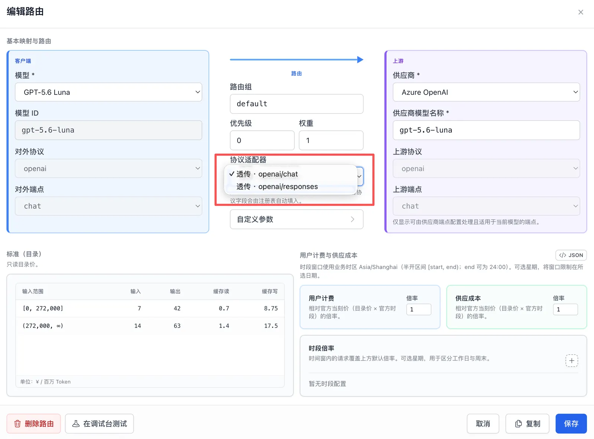
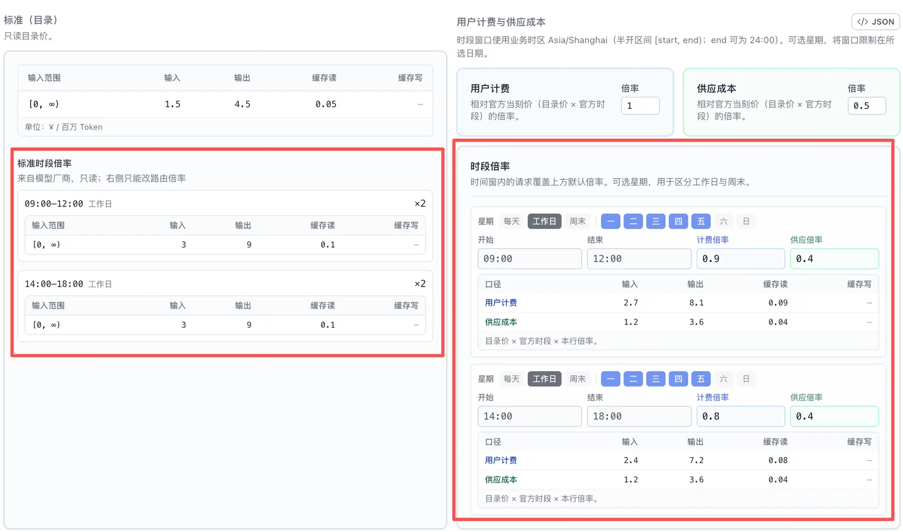
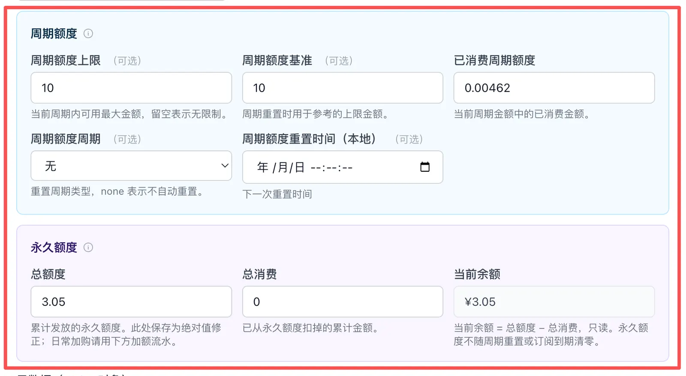
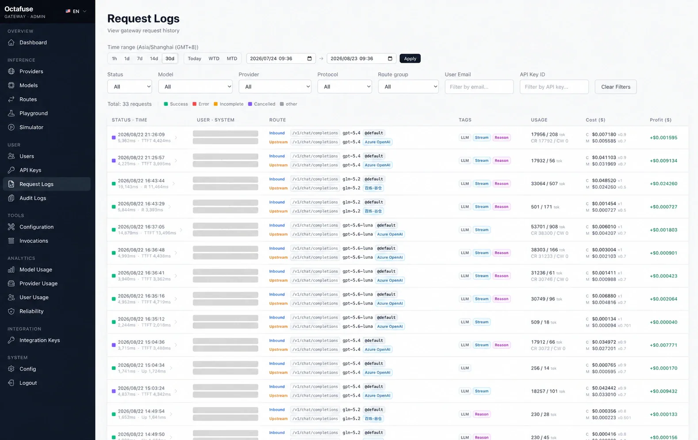

# 管理后台配置指南

本页按“部署好以后要做什么”的顺序组织。它不替代 API 文档，只帮助使用者在管理后台（Admin）中建立可用配置。

## 1. 先确认实例边界

| 项目 | 说明 |
|------|------|
| 代理服务 URL | 客户端实际调用地址，例如 `http://localhost:8787` 或 `https://gateway.example.com`。 |
| 管理后台 URL | 管理控制台地址，例如 `http://localhost:8789` 或 `https://gateway-admin.example.com`。 |
| 管理后台登录 | 只用于打开管理 UI。 |
| Admin API Key | 后台创建的具名、可授权 Bearer，用于外部系统调用 `/api/admin/*`。建议每个集成独立且最小权限。 |
| 用户 API Key | 发给客户端调用代理服务（Proxy）的 Key，不应与 Admin API Key 混用。 |

## 2. 配置供应商

供应商（Provider）表示一个上游模型入口。**一个供应商 = 一把上游 API Key + 启用状态**（`active` / `disabled`）。

配置时重点检查：

- 上游 Base URL / `endpoints` 与协议类型是否匹配。
- 上游 API Key 是否真实可用（列表为脱敏；明文经管理后台「显示」或 `GET /api/admin/providers/:id/api-key`）。
- 供应商 `status` 是否为 **active**（disabled 或空密钥的行不会参与调度）。
- 如使用导入模板，导入后须补齐真实 API Key（导入占位 key 会标为 pending）。

需要同一供应商多账号时：创建**多个供应商**（各一把 key），再在模型下挂多条路由——不要期望「一个供应商多把 key」。

供应商导入模板的维护说明见 [developers/reference/provider-import-presets.md](../developers/reference/provider-import-presets.md)。


## 3. 配置模型与路由

Routes 工作台支持**总览（Overview）**与**按模型（By model）**两种视角，并在 **Unrouted models** 区域集中展示尚未启用请求入口的模型。拓扑仍按 **请求入口（Request Surface）→ 路由池（Route Pool）→ 上游目标（Upstream Target）** 组织：请求入口表示客户端协议 / operation，路由池表示一组可故障转移的上游目标，上游目标才是具体供应商与上游模型。完整概念见 [developers/architecture/route-topology.md](../developers/architecture/route-topology.md)。


点击拓扑中的任一上游目标，即可打开路由编辑器。第一次配置时，建议按下面的最短路径完成：

1. 从目录导入或手动创建模型，使用一个稳定、便于客户端记忆的模型 ID。
2. 选择实际提供服务的供应商，填写上游模型名称。
3. 选择协议适配器，让管理后台自动匹配客户端入口和实际上游。
4. 保持路由组为 `default`；只有明确需要免费组、套餐组时再增加其他分组。
5. 保存后先用调试台验证单条上游路由，再用模拟器验证用户 Key、完整选路、计费和日志。

从模型目录导入 `hy4-preview`、`qwen3.8-flash`、`glm-5.3-flash` 等预设时，只会创建模型记录，不会自动维护模型标签。需要按供应商、套餐或用途分类时，请在导入后自行添加标签。

### 3.1 选择协议适配器

协议适配器下拉项会直接标明“客户端请求 → 实际上游”。选择后，管理后台会自动填入客户端协议、客户端操作、上游协议和上游操作，不需要手工猜测四个字段的组合。



常见选择：

| 使用场景 | 适配器选择 |
|----------|------------|
| 客户端与上游使用相同协议和操作 | 选择对应的“透传（Passthrough）”项 |
| OpenAI Images 调用百炼千问图片模型 | `dashscope-image-qwen` |
| OpenAI Images 调用百炼万相图片模型 | `dashscope-image-wan` |
| OpenAI 文件转写调用百炼 ASR | 选择与模型系列匹配的文件转写适配器 |

图片模型还要确认输出模态包含 `image`，并根据供应商规则选择按 Token 或按张计费；音频模型则根据 ASR / TTS 能力选择按时长、Token 或字符计费。完整差异见[图片模型说明](../developers/reference/image-models.md)与 [DashScope 音频说明](../developers/architecture/dashscope-audio.md)。

### 3.2 配置路由组、主备和默认参数

| 配置 | 普通部署建议 |
|------|--------------|
| `route_group` | 首条路由使用 `default`；客户端可用 `modelId:group` 显式选择其他组。 |
| `priority` | 数字越大越先尝试。主线路由用较高值，备用线路由用较低值。 |
| `weight` | 同一 priority 层中控制候选顺序或流量比例。只有一条路由时保持 `1` 即可。 |
| 路由策略 | 默认 `hash_affinity` 适合大多数部署；需要随机分流、固定权重主备或轮询时再更换。 |
| 供应商粘性 | 默认关闭；希望同一用户持续使用上次成功的供应商、提高缓存连续性时再按路由池启用。 |

在自定义参数（Custom params）中可以分开填写 HTTP 请求头和 JSON 请求体。请求头按 `Name: Value` 写入上游，不会进入 JSON；请求体则深度合并到上游 JSON。默认客户端明确传入的同名字段和同名请求头优先，适合提供缺省配置。请求头与请求体旁各有一个强制覆盖（Force override）开关，只锁死该侧，避免锁死 `max_tokens` 时连 `HTTP-Referer` 一起锁死。未在路由中配置的客户端请求头不会转发。路由策略和粘性的完整规则见[路由策略说明](../developers/reference/route-strategies.md)。

### 3.3 配置目录价与峰谷时段

供应商官方峰谷价与自己对用户的折扣或加价应分开维护：

1. 在模型（Models）中填写目录标准价（Standard），并按需设置供应商官方时段。
2. 在路由中设置默认的用户计费（Charged）和供应成本（Metered）倍率。
3. 模型存在官方时段时，路由会沿用相同的起止时间和星期，只需要填写各时段的两侧倍率。
4. 保存前查看每个时段下方的实际价格预览，确认用户价格和供应成本符合预期。

价格关系可以简化理解为：

> 目录标准价 × 模型官方时段倍率 × 路由倍率



模型未配置官方时段时，路由仍可独立增加分时时段。以低谷价为目录价的 DeepSeek 路由，可以将默认倍率设为 `1`，并为周一至周五 `09:00–12:00`、`14:00–18:00` 设置 `2` 倍；工作日其他时间和周末会自动使用低谷价。

门户不需要手工解析这些配置。`GET /v1/models` 和 `GET /catalog/models` 会在 `discounts` 中返回各路由组当前生效倍率、后续窗口和业务时区；`Discount.<group>:<factor>` 标签也会由 Gateway 自动生成，不要手工维护 `Discount*` 标签。

保存后在请求日志中核对供应成本、官方当刻目录价和用户计费。模型官方时段变更只影响后续请求，不会重算历史记录。

### 3.4 百炼千问 / 万相生图

千问图像 3.0 与万相 2.7 使用 DashScope 原生生图接口，但客户端无需改成百炼协议。配置路由时：

1. 在供应商中配置可用的 DashScope 端点；千问 Token Plan 需显式提供 `images.generations.multimodal` 端点。
2. 客户端请求入口保持 `openai` / `images.generations`。
3. 千问选择 `dashscope-image-qwen`，万相选择 `dashscope-image-wan`。管理后台会自动填入上游 `dashscope` / `images.generations.multimodal`。
4. 在调试台（Playground）验证单条上游路由，在模拟器（Simulator）通过 `/v1/images/generations` 验证真实鉴权、路由、计费和日志。

千问一次可生成 1–6 张，万相可生成 1–4 张；Gateway 在未传 `n` 时会明确按 1 张请求，避免万相采用上游默认值一次生成 4 张。返回格式默认是图片 URL；客户端显式传入 `response_format=b64_json` 时，Gateway 会尝试下载结果并转成 Base64。完整参数和计费差异见 [DashScope 生图架构](../developers/architecture/dashscope-image.md)。

路由默认参数合并规则见 [developers/api/user.md](../developers/api/user.md#route-默认参数合并)；时段调价契约见 [developers/api/admin.md](../developers/api/admin.md) 中的 `pricing_profile.schedule` 与 `price_override.schedule`；调度与熔断见 [developers/architecture/proxy-request-lifecycle.md](../developers/architecture/proxy-request-lifecycle.md)。

## 4. 配置智能体工具（可选）

智能体工具（Agent Tools）是代理服务上面向 Agent 的 **可扩展产品 API**（`/v1/tools/*`），**不是** Chat Completions 的一部分。在管理后台 → **智能体工具 → 工具配置（Tools → Configuration）**：

- 每种工具以供应商卡片展示各引擎；点击卡片后在右侧抽屉维护凭证与三账本单价：**目录标准价（Standard）/ 用户计费（Charged）/ 供应成本（Metered）**。
- 当前工具与引擎：
  - **Web Search**：博查、Tavily、阿里云 CleverSee、腾讯云联网搜索 WSA
  - **Web Fetch**：Firecrawl、Tavily Extract、Jina Reader
  - **Web Deep Search**：Firecrawl Search、Jina Search
  - **AI 率检测（AI Detection）**：多引擎 catalog，当前仅腾讯云 TMS 已实现；按 `billingUnitChars` 字符单元计费
- **仅保存配置**不会切换线上引擎；**保存并启用**会保存当前草稿并把该供应商设为此工具唯一的活跃引擎（Active）。未实现或凭证不完整的引擎不可启用。
- 卡片会提示活跃、未保存、缺少凭证、暂不可用与亏损定价（`charged < metered`）等状态。清空当前活跃引擎的凭证前，应先切换到另一个凭证完整的引擎。
- 成功请求分别按三种绝对单价写入 `metered_cost` / `standard_cost` / `charged_cost`，仅 **charged** 累加用户预算；上游失败三列均为 0。智能体工具不应用模型路由倍率或分时时段。币种由 `BILLING_CURRENCY` 决定，调用记录见 **智能体工具 → 工具调用记录（Tools → Invocations）**（与请求日志同源）。

字段与引擎白名单见 [developers/api/user.md](../developers/api/user.md) 中各 Tools 章节。

## 5. 创建用户与 API Key

用户 API Key 是客户端真正使用的凭证。对接外部门户时可用 `external_system` 区分产品或租户，并以 `(external_system, external_user_id)` 幂等创建 User；预算归属 User，API Key 负责鉴权、扣费归集和审计。

用户详情把额度拆成两个独立部分：

- **周期额度**：可按日、周、月重置，也可以不自动重置；到期后按套餐规则恢复或清零。
- **永久额度**：来自加购、注册赠额、退款等场景，不随周期重置或订阅到期清零；当前余额 = 总额度 − 总消费。

一次请求会先扣周期额度，周期剩余不足时才从永久额度扣除差额。因此周期额度上限为 `0`、但永久额度仍有余额的用户可以继续调用。用户详情中的永久额度总额和总消费字段用于运维修正绝对值；日常加购应调用 `POST /api/admin/users/:id/wallet/credit`，并为每笔业务传入唯一的 `external_ref`，避免订单重试导致重复加额。不要继续通过累加 `budget_max` 发放购买额度。



建议：

- 为不同人、团队、客户或项目创建独立用户或独立 Key。
- 给 Key 设置可识别名称和 metadata，方便后续审计。
- 为用户设置预算与周期重置策略。
- 在用户详情中核对永久额度的总额度、总消费和当前余额；需要追溯加购时查看下方加额流水。
- 需要为特定用户提供模型折扣或免单时，在用户详情的 **Charged cost factors** 中选择目录模型并填写倍率：`0.8` 表示八折，`0.5` 表示五折，`0` 表示该模型不扣费；未配置的模型保持路由计算出的价格。
- 停用不再需要的 Key，而不是长期共享一把 Key。

最终用户费用为“官方当刻目录价（目录档 × 模型官方时段）× 路由用户计费倍率（含命中的路由分时时段）× 用户模型倍率”。用户模型倍率只改变最终 `charged_cost` 与预算累加，不改变官方当刻价或供应成本；适用于 LLM、Images 与 Audio，不适用于 Agent Tools。

用户、Key、预算、用户模型倍率和审计的数据模型见 [developers/architecture/user-keys-data-model.md](../developers/architecture/user-keys-data-model.md)。

## 6. 验证调用

最小验证：

```bash
curl -sS http://localhost:8787/health
curl -sS http://localhost:8787/catalog/models
```

用户推理、Images、Audio、Tools 与各协议客户端示例见 [connect-clients.md](./connect-clients.md)；完整 API 字段见 [developers/api/user.md](../developers/api/user.md)。

预算状态验证：

```bash
curl -sS http://localhost:8787/v1/me \
  -H "Authorization: Bearer sk-your-api-key"
```

响应会分别返回周期额度、永久额度和总剩余额度；`budget_max` 为 `null` 时表示周期额度不限额，此时 `total_remaining` 也为 `null`。

### 在调试台验证实时语音识别

1. 打开推理 → 调试台（Inference → Playground），选择已配置的 DashScope 实时 ASR 路由。
2. 输入来源选择浏览器麦克风，并允许浏览器使用麦克风。
3. 开始录音后讲话，观察 WebSocket 连接状态和上游返回的识别事件；结束后主动停止会话。

调试台直连所选上游，不扣用户额度，也不写请求日志。Cloudflare 与 Docker 管理后台都支持这条实时 WebSocket 链路；Docker 部署必须使用与 Gateway 相同版本的 Admin 镜像及其 `node-server.mjs` 入口。

## 7. 日常观察

日常排障优先看：



- 请求日志：先在列表中核对客户端入口（Inbound）、实际上游（Upstream）、模型、路由组、供应商、功能标签和用量；展开后重点查看 `request_operation`、`model_surface_id`、`route_pool_id`、`route_target_id`、`route_trace`。启用供应商粘性后查看 `route_trace.sticky.lookup`、`attempted_target` 与 `result`，结合 cache read token 和 failover 次数判断绑定收益及异常解绑。`provider_key_*` 现为 provider id / name / key 指纹；Tools 行为 `model_id` 形如 `tool:web-search`。
- 错误状态：401 多半是认证问题；403 常见于预算或配额；502 多与路由或上游有关；全部上游熔断时可能为网关 **429**；智能体工具未配置活跃引擎 Key 时为 **503**。
- 成本字段：列表中的 `C` 是最终用户计费（`charged_cost`），`M` 是供应成本（`metered_cost`）；官方当刻目录价为 `standard_cost`（含模型官方时段，不含路由倍率）。`pricing_audit` 还可记录 `user_charged_factor`、`local_weekday`、目录时段与路由分时时段；Images / Audio 另见 `billing_kind`（及 image count / `audio_duration_seconds` 等列）。
- 周期与永久额度：请求日志接口中的 `charged_wallet_cost` 表示本次从永久额度扣除的部分，周期额度扣除额为 `charged_cost − charged_wallet_cost`。管理后台的审计日志（Audit Logs）会把两部分变化拆开显示。
- 审计日志（Audit Logs）：确认周期额度扣减、永久额度扣减与加额、周期重置、Key 生命周期等事件；用户详情下方的加额流水可快速查看当前用户的永久额度变动。

更细的日志和计费语义见 [developers/reference/streaming-billing.md](../developers/reference/streaming-billing.md)、[developers/reference/image-models.md](../developers/reference/image-models.md)、[developers/api/user.md「语音转写」](../developers/api/user.md#语音转写audio-transcriptions) 与 [developers/reference/user-audit-logs.md](../developers/reference/user-audit-logs.md)。
